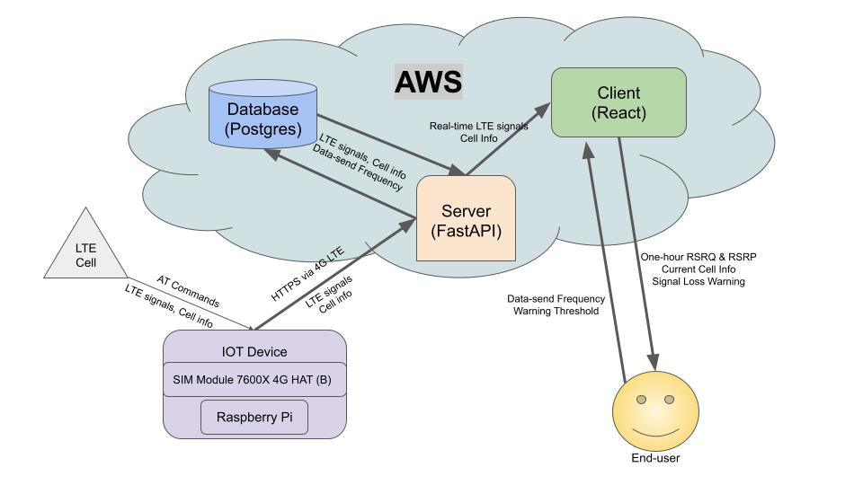

## junctionx-hanoi-2023-iot-newbees
This is a work for the [JunctionX Hanoi 2023 Hackathon](https://www.junctionxhanoi2023.com/).<br>
- Team: **NEWBEES**<br>
- Repo description: Server and database setup.
- Link to presentation
  - PowerPoint Slides: [link to Google Drive](https://docs.google.com/presentation/d/1bPi0vrQAUJJFnyKqWmuZRpBibypFUIaYIDAKa4smMN4/edit?usp=sharing)
  - Full presentation:

<iframe src="https://www.facebook.com/plugins/video.php?height=314&href=https%3A%2F%2Fwww.facebook.com%2FJunctionVietnam%2Fvideos%2F2731682633641352%2F&show_text=false&width=560&t=7400" width="560" height="314" style="border:none;overflow:hidden" scrolling="no" frameborder="0" allowfullscreen="true" allow="autoplay; clipboard-write; encrypted-media; picture-in-picture; web-share" allowFullScreen="true"></iframe>


<figure>
  
  <figcaption>Entire System Architecture</figcaption>
</figure>

---------

## Set-up Guidelines
### Project Setup
Go through the following steps when you **first** set up or restart the project.

Create a new virtual environment:<br>
`python3 -m venv venv`

Activate it:<br>
`source venv/bin/activate`

Install requirements<br>
`pip install -r requirements.txt`

Set up database:<br>
Install postgreSQL: https://www.postgresql.org/download/

Start postgresql:<br>
`sudo service postgresql start`

Set up user:<br>
`sudo -u postgres createuser fastapi-songs --pwprompt`

### Server Setup
Go through the following steps when you first set up the project or are re-running the server.

Create test database:<br>
`sudo -u postgres psql -c "create database fastapi;"`

init db:<br>
`python3 init_db.py`

Run server:<br>
`uvicorn main:app --reload`

---

## API Calls
#### `GET` /signals/
Get all LTE signals

#### `GET` /get_last_signal/
Get last LTE signal

#### `GET` /get_n_signals/?scellid=*{scellid}*&signal_count=*{signal_count}*
Get last `signal_count` LTE signals (optional - from S-Cell ID=`scellid`)

#### `GET` /get_1hr_signals/?scellid=*{scellid}*
Get last 1 hour of LTE signals (optional - from S-Cell ID=`scellid`)

#### `GET` /cells/
Get all LTE cells' info

#### `GET` /get_last_cell/
Get most recent LTE cell's info

#### `GET` /get_last_cell_change_timestamp/
Get last LTE cell change's timestamp

#### `GET` /get_current_frequency/
Get current frequency

#### `POST` /post_signal/
Update signal database<br>
Request body (`required`)<br>

```
# Example value
{
  "pcellid": "string",
  "scellid": "string",
  "mcc": "string",
  "mnc": "string",
  "rsrq": 0,
  "rsrp": 0
}
```

### `POST` /update_current_frequency/{frequency}
Update frequency value<br>
Request body (`required`)<br>
    `frequency`: `int` new frequency